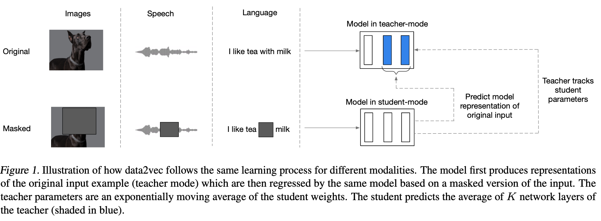
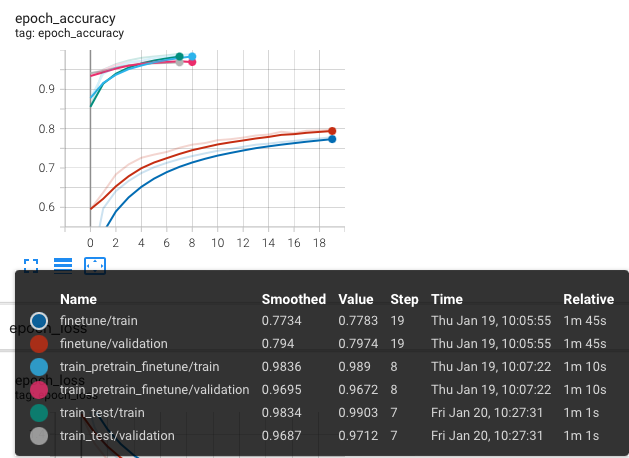
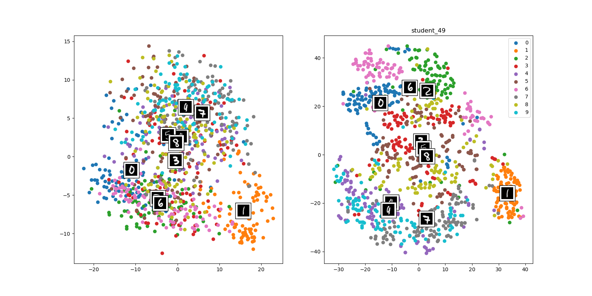
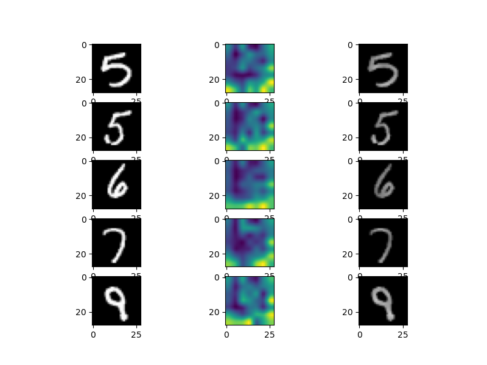
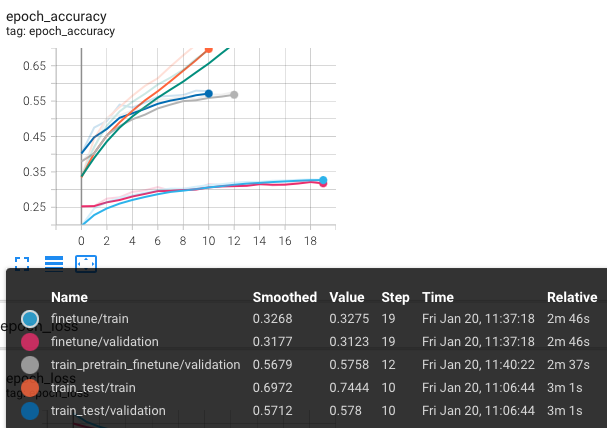
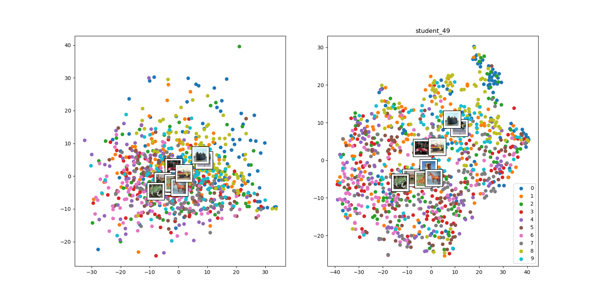
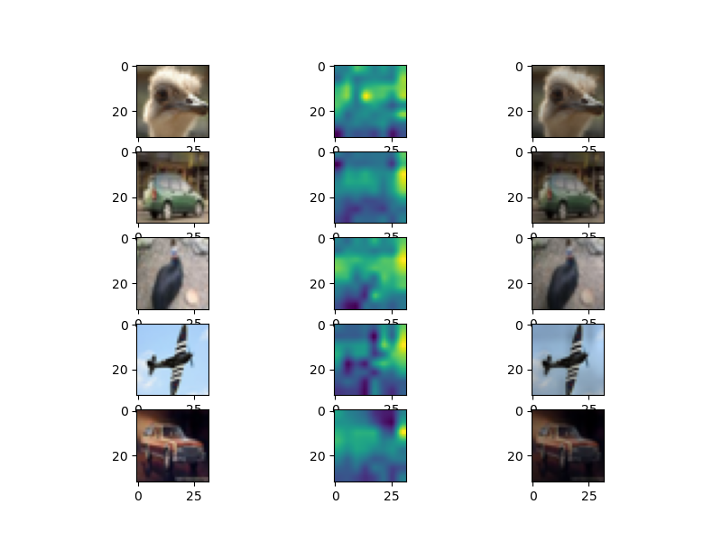

Data2Vec
===

### Architecture

Base netowkr -> ViT
### Problem definition
We use the MNIST and CIFAR10 datastes to show the framework works well in practice.  
And any model can apply this framework by self-supervised sequence module.

### Result
- MNIST
    |Accuracy|Student netowrk latent space(PCA, TSNE)|Student attention map|
    |-|-|-|
    ||||
    - The accuracy doesn't improve in transfer learning by Data2Vec.
    - However, the data is spread across the latent space by class. 
    - parameters
        - multi-head : 4
        - transformer block : 3
- CIFAR10
    |Accuracy|Student netowrk latent space(PCA, TSNE)|Student attention map|
    |-|-|-|
    ||||
    - The dataset of CIFAR10 is also doesn't improve performance.  
    - The points doesn't spread by class.
    - And the attention map also performs poorly. because of its low accuracy.
    - parameters
        - multi-head : 8
        - transformer block : 8

### Enviroment
tensorflow = 2.10

### Reference
[1] Baevski, Alexei, et al. "Data2vec: A general framework for self-supervised learning in speech, vision and language." arXiv preprint arXiv:2202.03555 (2022).  
[2] Dosovitskiy, Alexey, et al. "An image is worth 16x16 words: Transformers for image recognition at scale." arXiv preprint arXiv:2010.11929 (2020).